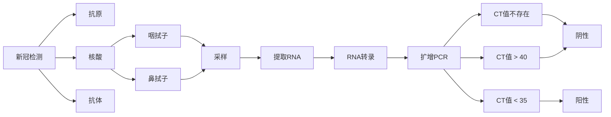
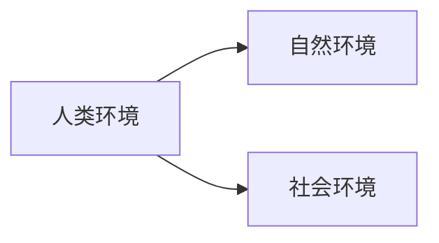

# 环境保护与可持续发展

---

1. 课堂展示

   任选一周，针对上一周课上讲的内容的某个特定知识点进行展开，15分钟展示时间

---

## 导论

### 1. 新型冠状病毒的检测方法

### 2. 病毒的原理

1. 吸附
2. 侵入与脱壳
3. 复制和合成
4. 装配子代

### 3. 病毒的分类

按病毒的宿主划分：

1. 植物病毒 —— 植物
2. 动物病毒 —— 动物
3. 细菌病毒（噬菌体）—— 人和微生物

---

## 第一章 绪论

### 1. 环境的范畴

> 环境（Environment）：影响人类生存和发展的各种天然和人工改造的整体

* 生态环境
* 建成环境
* 社会环境 
* 自然环境
* 宇宙环境

### 2. 社会环境

社会环境是指在自然环境的基础上，人类通过长期有意识的社会劳动所创造的环境

* 政治环境
* 经济环境
* 法制环境
* 文化环境

### 3. 自然环境

* 青藏高原

  “三江并流”的四个世界之最

  * 江水并流而不交汇
  * 高山地貌及其演化的代表地区
  * 丰富的地质地貌
  * 生物物种最丰富的地区 —— 世界生物的基因库

* 丹霞

* 被除名的世界遗产

  * 阿拉伯羚羊保护区
  * 英国利物浦海事商城

### 4. 环境问题

* 环境问题是由于人类活动作用与周围环境所引起的不利于人类生存和发展的各种现象

#### 4.1 原生环境问题

* 原生环境问题
  * 地质灾害
  * 灾害性天气
  * 水文灾害
  * 生物灾害
* 原生环境问题的表现方式
  * 骤发性自然灾害
  * 长期性自然灾害
* 自然灾害的关联性

#### 4.2 次生环境问题（第二环境问题）

* 环境污染
  * 环境自净能力
  * 环境容量
* 生态破坏 —— 超过了环境自身调节能力
  * 生态环境的早期破坏
  * 近代城市的环境问题 —— 工业革命到八十年代
* 当代环境问题
  * 全球变暖
  * 酸雨
  * 能源短缺
  * 土地荒漠化
  * 垃圾和固体废弃物污染
  * 臭氧层破坏
  * 淡水资源问题
  * 森林锐减
  * 生物多样性锐减
  * 有毒化学品污染

